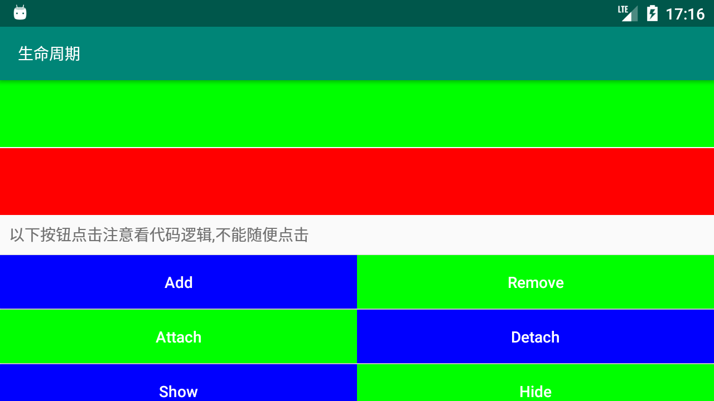

# Activity + Fragment 基础知识

> * **作者**：March
> * **链接**：[安卓项目或模块](https://github.com/maoqiqi/DevelopmentArms)
> * **邮箱**：fengqi.mao.march@gmail.com
> * **头条**：https://toutiao.io/u/425956/subjects
> * **简书**：https://www.jianshu.com/u/02f2491c607d
> * **掘金**：https://juejin.im/user/5b484473e51d45199940e2ae
> * **CSDN**：http://blog.csdn.net/u011810138
> * **SegmentFault**：https://segmentfault.com/u/maoqiqi
> * **StackOverFlow**：https://stackoverflow.com/users/8223522
>
> 著作权归作者所有。商业转载请联系作者获得授权，非商业转载请注明出处。


学习Activity和Fragment生命周期，Fragment与Activity通信，以及系统销毁APP时，重创建如何恢复之前的状态。


## 目录

* [Activity](#Activity)
  * [Activity三种状态](#Activity三种状态)
  * [Activity生命周期回调](#Activity生命周期回调)
* [Fragment](#Fragment)
  * [Fragment三种状态](#Fragment三种状态)
  * [Fragment生命周期回调](#Fragment生命周期回调)
  * [Fragment使用](#Fragment使用)
    * [静态加载](#静态加载)
    * [动态加载](#动态加载)
    * [执行片段事务生命周期变化](#执行片段事务生命周期变化)
  * [Fragment重叠](#Fragment重叠)
  * [DialogFragment](#DialogFragment)
    * [重写onCreateView创建Dialog](#重写onCreateView创建Dialog)
    * [重写onCreateDialog创建Dialog](#重写onCreateDialog创建Dialog)
    * [DialogFragment做屏幕适配](#DialogFragment做屏幕适配)
* [Activity重创建](#Activity重创建)
  * [保存Activity状态](#保存Activity状态)
  * [恢复Activity状态](#恢复Activity状态)
* [处理运行时变更](#处理运行时变更)
  * [在配置变更期间保留对象](#在配置变更期间保留对象)
  * [自行处理配置变更](#自行处理配置变更)
* [Fragment与Activity通信](#Fragment与Activity通信)
* [Screenshot](#Screenshot)
* [Link](#Link)


## Activity

### Activity三种状态

Activity基本上以三种状态存在：

* 继续：此Activity位于屏幕前台并具有用户焦点。（有时也将此状态称作“运行中”。）
* 暂停：另一个Activity位于屏幕前台并具有用户焦点，但此Activity仍可见。也就是说，另一个Activity显示在此Activity上方，并且该Activity部分透明或未覆盖整个屏幕。
  暂停的Activity处于完全活动状态（Activity对象保留在内存中，它保留了所有状态和成员信息，并与窗口管理器保持连接），但在内存极度不足的情况下，可能会被系统终止。
* 停止：该Activity被另一个Activity完全遮盖（该Activity目前位于“后台”）。
  已停止的Activity同样仍处于活动状态（Activity对象保留在内存中，它保留了所有状态和成员信息，但未与窗口管理器连接）。
  不过，它对用户不再可见，在他处需要内存时可能会被系统终止。

### Activity生命周期回调

Activity基本生命周期方法见 [Android Guide 实现生命周期回调](https://developer.android.google.cn/guide/components/activities#ImplementingLifecycleCallbacks)。

您可以通过实现这些方法监控Activity生命周期中的三个嵌套循环：

* Activity的整个生命周期发生在onCreate()调用与onDestroy()调用之间。
  您的Activity应在onCreate()中执行“全局”状态设置（例如定义布局），并释放onDestroy()中的所有其余资源。
  例如，如果您的Activity有一个在后台运行的线程，用于从网络上下载数据，它可能会在onCreate()中创建该线程，然后在onDestroy()中停止该线程。

  生命周期：

  * "运行"-->"死亡" onCreate()-->onStart()-->onResume() 可见可操作(运行状态)
  * "运行"-->"死亡" onPause()-->onStop()-->onDestroy() Activity对象成为垃圾对象(不可见也不存在死亡状态)

* Activity的可见生命周期发生在onStart()调用与onStop()调用之间。
  在这段时间，用户可以在屏幕上看到Activity并与其交互。
  例如，当一个新Activity启动，并且此Activity不再可见时，系统会调用onStop()。您可以在调用这两个方法之间保留向用户显示Activity所需的资源。
  例如，您可以在onStart()中注册一个BroadcastReceiver以监控影响UI的变化，并在用户无法再看到您显示的内容时在onStop()中将其取消注册。
  在Activity的整个生命周期，当Activity在对用户可见和隐藏两种状态中交替变化时，系统可能会多次调用onStart()和onStop()。

  生命周期：

  * "运行"-->"停止" onPause()-->onStop() 不可见但存在
  * "停止"-->"运行" onRestart()-->onStart()-->onResume()

* Activity的前台生命周期发生在onResume()调用与onPause()调用之间。
  在这段时间，Activity位于屏幕上的所有其他Activity之前，并具有用户输入焦点。
  Activity可频繁转入和转出前台—例如，当设备转入休眠状态或出现对话框时，系统会调用onPause()。
  由于此状态可能经常发生转变，因此这两个方法中应采用适度轻量级的代码，以避免因转变速度慢而让用户等待。

  生命周期：

  * "运行"-->"暂停" onPause()
  * "暂停"-->"运行" onResume()

下图说明了这些循环以及Activity在状态转变期间可能经过的路径。矩形表示回调方法，当Activity在不同状态之间转变时，您可以实现这些方法来执行操作。


当一个Activity启动另一个Activity时，它们都会体验到生命周期转变。第一个Activity暂停并停止（但如果它在后台仍然可见，则不会停止）时，同时系统会创建另一个Activity。
必须了解的是，在创建第二个Activity前，第一个Activity不会完全停止。更确切地说，启动第二个Activity的过程与停止第一个Activity的过程存在重叠。

生命周期回调的顺序经过明确定义，当两个Activity位于同一进程，并且由一个Activity启动另一个Activity时，其定义尤其明确。
以下是当ActivityA启动ActivityB时一系列操作的发生顺序：

1. Activity A 的onPause()方法执行。
2. Activity B 的onCreate()、onStart()和onResume()方法依次执行。（Activity B 现在具有用户焦点。）
3. 然后，如果ActivityA在屏幕上不再可见，则其onStop()方法执行。

您可以利用这种可预测的生命周期回调顺序管理从一个Activity到另一个Activity的信息转变。
例如，如果您必须在第一个Activity停止时向数据库写入数据，以便下一个Activity能够读取该数据，则应在onPause()而不是onStop()执行期间向数据库写入数据。

## Fragment

### Fragment三种状态

管理片段生命周期与管理Activity生命周期很相似。和Activity一样，片段也以三种状态存在：

* 继续：片段在运行中的Activity中可见。
* 暂停：另一个Activity位于前台并具有焦点，但此片段所在的Activity仍然可见（前台Activity部分透明或未覆盖整个屏幕）。
* 停止：片段不可见。宿主Activity已停止，或片段已从Activity中移除，但已添加到返回栈。停止片段仍然处于活动状态（系统会保留所有状态和成员信息）。
  不过，它对用户不再可见，如果Activity被终止，它也会被终止。

### Fragment生命周期回调

Fragment类的代码与Activity非常相似。它包含与Activity类似的回调方法，如onCreate()、onStart()、onPause()和onStop()。
实际上，如果您要将现有Android应用转换为使用片段，可能只需将代码从Activity的回调方法移入片段相应的回调方法中。


通常，您至少应实现以下生命周期方法：

* onCreate()：系统会在创建片段时调用此方法。您应该在此初始化您想在片段暂停或停止后恢复时需要的数据。
* onCreateView()：系统会在片段首次绘制其用户界面时调用此方法。要想为您的片段绘制UI，您从此方法中返回的View必须是片段布局的根视图。如果片段未提供UI，您可以返回null。
* onPause()：系统将此方法作为用户离开片段的第一个信号（但并不总是意味着此片段会被销毁）进行调用。您通常应该在此方法内确认在当前用户会话结束后仍然有效的任何更改（因为用户可能不会返回）。

> 注意：如果您的片段是ListFragment的子类，则默认实现会从onCreateView()返回一个ListView，因此您无需实现它。

大多数应用都应该至少为每个片段实现这三个方法，但您还应该使用几种其他回调方法来处理片段生命周期的各个阶段。

Activity生命周期与片段生命周期之间的最显著差异在于它们在其各自返回栈中的存储方式。
默认情况下，Activity停止时会被放入由系统管理的Activity返回栈（以便用户通过返回按钮回退到Activity）。
不过，仅当您在移除片段的事务执行期间通过调用addToBackStack()显式请求保存实例时，系统才会将片段放入由宿主Activity管理的返回栈。

在其他方面，管理片段生命周期与管理Activity生命周期非常相似。因此，管理Activity生命周期的做法同样适用于片段。
但您还需要了解Activity的生命周期对片段生命周期的影响。


图示说明了受其宿主Activity影响的片段生命周期流。
在该图中，您可以看到Activity的每个连续状态如何决定片段可以收到的回调方法。
例如，当Activity收到其onCreate()回调时，Activity中的片段只会收到onActivityCreated()回调。

> 注意：如需Fragment内的某个Context对象，可以调用getActivity()。但要注意，请仅在片段附加到Activity时调用getActivity()。
如果片段尚未附加，或在其生命周期结束期间分离，则getActivity()将返回null。

### Fragment使用

#### 静态加载

1. 定义Fragment的子类，并加载一个布局文件。
2. 在布局文件中通过<fragment>指定指定自定义Fragment。
3. 我们的Activity必须继承于FragmentActivity。

```
<fragment
    android:id="@+id/static_fragment"
    android:name="com.codearms.maoqiqi.activityfragment.fragment.StaticFragment"
    android:layout_width="match_parent"
    android:layout_height="60dp"
    android:layout_weight="1" />
```

> 注意：每个Fragment本质上都会生成一个FrameLayout，它加载的布局为其子布局。

#### 动态加载

在Activity中使用片段的一大优点是，可以根据用户行为通过它们执行添加、移除、替换以及其他操作。
您提交给Activity的每组更改都称为事务，您可以使用FragmentTransaction中的API来执行一项事务。
您也可以将每个事务保存到由Activity管理的返回栈内，从而让用户能够回退片段更改（类似于回退Activity）。

每个事务都是您想要同时执行的一组更改。您可以使用add()、remove()和replace()等方法为给定事务设置您想要执行的所有更改。
然后，要想将事务应用到Activity，您必须调用commit()。

不过，在您调用commit()之前，您可能想调用addToBackStack()，以将事务添加到片段事务返回栈。
该返回栈由Activity管理，允许用户通过按返回按钮返回上一片段状态。

例如，以下示例说明了如何将一个片段替换成另一个片段，以及如何在返回栈中保留先前状态：

```
// 1.创建Fragment对象
Fragment newFragment = new ExampleFragment();
// 2.得到FragmentManager
FragmentManager fragmentManager = getSupportFragmentManager();
// 3.得到FragmentTransaction
FragmentTransaction transaction = fragmentManager.beginTransaction();
// 4.替换Fragment对象
transaction.replace(R.id.fragment_container, newFragment);
// 5.添加到回退栈
transaction.addToBackStack(null);
// 6.提交
transaction.commit();
```

在上例中，newFragment会替换目前在R.id.fragment_container Id所标识的布局容器中的任何片段（如有）。
通过调用addToBackStack()可将替换事务保存到返回栈，以便用户能够通过按返回按钮撤消事务并回退到上一片段。

如果您向事务添加了多个更改（如又一个add()或remove()），并且调用了addToBackStack()，
则在调用commit()前应用的所有更改都将作为单一事务添加到返回栈，并且返回按钮会将它们一并撤消。

向FragmentTransaction添加更改的顺序无关紧要，不过：

* 您必须最后调用commit()。
* 如果您要向同一容器添加多个片段，则您添加片段的顺序将决定它们在视图层次结构中的出现顺序。

如果您没有在执行移除片段的事务时调用addToBackStack()，则事务提交时该片段会被销毁，用户将无法回退到该片段。
不过，如果您在删除片段时调用了addToBackStack()，则系统会停止该片段，并在用户回退时将其恢复。

> 注意：对于每个片段事务，您都可以通过在提交前调用setTransition()来应用过渡动画。

调用commit()不会立即执行事务，而是在Activity的UI线程（“主”线程）可以执行该操作时再安排其在线程上运行。
不过，如有必要，您也可以从UI线程调用executePendingTransactions()以立即执行commit()提交的事务。
通常不必这样做，除非其他线程中的作业依赖该事务。

您只能在Activity保存其状态（用户离开Activity）之前使用commit()提交事务。
如果您试图在该时间点后提交，则会引发异常。这是因为如需恢复Activity，则提交后的状态可能会丢失。
对于丢失提交无关紧要的情况，请使用commitAllowingStateLoss()。

> **注意**：每个片段都需要一个唯一的标识符，Activity重创建时，系统可以使用该标识符来恢复片段（您也可以使用该标识符来捕获片段以执行某些事务，如将其移除）。可以通过三种方式为片段提供Id：
>
> * 为android:id属性提供唯一Id。
> * 为android:tag属性提供唯一字符串。
> * 如果您未给以上两个属性提供值，系统会使用容器视图的Id。

#### 执行片段事务生命周期变化

* add & remove

  add：向containerViewId中添加一个Fragment实例。此时Fragment执行下面的生命周期：

  ```
  onAttach()-->onCreate()-->onCreateView()-->onViewCreated()-->
  onActivityCreated()-->onViewStateRestored()-->onStart()-->onResume()
  ```

  remove：移除一个Fragment实例。如果移除时这个fragment没有被添加到回退栈，就会销毁这个Fragment实例。执行下面的生命周期：

  `onPause()-->onStop()-->onDestroyView()-->onDestroy()-->onDetach()`

  如果移除时把fragment加入回退栈，比如：

  ```
  FragmentTransaction transaction = getSupportFragmentManager().beginTransaction();
  transaction.remove(fragment).addToBackStack(null).commit();
  ```

  此时Fragment实例不会被销毁，只执行下面的生命周期：

  `onPause()-->onStop()-->onDestroyView()`

* attach & detach

  attach：重新创建Fragment视图。Fragment执行下面的生命周期：

  `onCreateView()-->onViewCreated()-->onActivityCreated()-->onViewStateRestored()-->onStart()-->onResume()`

  detach：销毁Fragment的视图，但保留实例。Fragment执行下面的生命周期：

  `onPause()-->onStop()-->onDestroyView()`

* show & hide

  show：显示Fragment。设为可见状态，并不执行任何生命周期方法，不销毁实例，也不销毁视图，只是把Fragment的视图设置为VISIBLE。
  此时Fragment的mHidden为false，会回调onHiddenChanged()。

  hide：隐藏Fragment。设为为不可见状态，并不执行任何生命周期方法，不销毁实例，也不销毁视图，只是把Fragment的视图设置为INVISIBLE。
  此时Fragment的mHidden为true，会回调onHiddenChanged()。

* replace

  先移除所有containerViewId中的实例，然后添加一个新的Fragment实例。

以上方法详细测试日志请查看：

* [[Add-->Remove]](log/fragment_methods_1.txt)
* [[Add-->Detach-->Attach-->Remove]](log/fragment_methods_2.txt)
* [[Add-->Hide-->Show-->Remove]](log/fragment_methods_3.txt)
* [[Add-->Replace]](log/fragment_methods_4.txt)

**注意**：

1. 需要注意的是视图销毁之后，界面上保留的一些数据也就没有了。
比如用户在EditText中输入了数据，你执行remove并把事务添加到回退栈，按下back键，这时候EditText中就没有数据了，如果你希望保留数据就用hide。
2. Fragment实例销毁，视图自然销毁.但视图销毁，实例不一定销毁。
3. 一般情况下Fragment实例销毁才会执行onDetach方法，但是还有另外一种情况就是Fragment实例还在，Activity实例却销毁了。
也很好理解，你关联的Activity实例都没有了，这种情况其实就是我们下面要说的[setRetainInstance](#setRetainInstance)。

### Fragment重叠

**重叠?不存在的**

只要理解并处理好上面所说的问题，同时使用24.0.0以上版本的support库的话，一般就不会再出现Fragment的重叠问题。

**24.0.0以下版本bug：**

24.0.0之前的support库有一个bug，就是在FragmentManager保存Fragment实例状态的时候，没有保存mHidden，因此重创建之后Fragment都处于显示状态就造成了重叠.以下是截图：


### DialogFragment

DialogFragment在android 3.0时被引入。是一种特殊的Fragment，用于在Activity的内容之上展示一个对话框。典型的用于：展示警告框，输入框，确认框等。

在DialogFragment之前，我们创建对话框：一般采用AlertDialog和Dialog。官方不推荐直接使用Dialog创建对话框。

使用DialogFragment来管理对话框，当Activity重创建和按下后退键时可以更好的管理其生命周期，它和Fragment有着基本一致的声明周期。
而且DialogFragment也允许开发者把Dialog作为内嵌的组件进行重用，类似Fragment（可以在大屏幕和小屏幕显示出不同的效果）。

使用DialogFragment至少需要实现onCreateView或者onCreateDialog方法。onCreateView即使用定义的xml布局文件展示Dialog。onCreateDialog即利用AlertDialog或者Dialog创建出Dialog。

#### 重写onCreateView创建Dialog

1. 创建布局文件。
2. 继承DialogFragment重写onCreateView方法。
3. 在Activity中调用。

```
public class DialogFragment1 extends DialogFragment {

    @Nullable
    @Override
    public View onCreateView(@NonNull LayoutInflater inflater, @Nullable ViewGroup container, @Nullable Bundle savedInstanceState) {
        super.onCreateView(inflater, container, savedInstanceState);
        return inflater.inflate(R.layout.activity_dialog, container, false);
    }
}
```

#### 重写onCreateDialog创建Dialog

1. 创建布局文件。
2. 继承DialogFragment重写onCreateDialog方法。
3. 在Activity中调用。

```
public class DialogFragment2 extends DialogFragment {

    @NonNull
    @Override
    public Dialog onCreateDialog(@Nullable Bundle savedInstanceState) {
        super.onCreateDialog(savedInstanceState);
        return new AlertDialog.Builder(getActivity(), R.style.DialogTheme).setView(R.layout.activity_dialog).create();
    }
}
```

#### DialogFragment做屏幕适配

我们希望，一个对话框在大屏幕上以对话框的形式展示，而小屏幕上则直接嵌入当前的Activity中。这种效果的对话框，只能通过重写onCreateView实现。

```
FragmentManager fragmentManager = getSupportFragmentManager();
DialogFragment1 fragment = new DialogFragment1();

boolean isLargeLayout = getResources().getBoolean(R.bool.large_layout);
if (isLargeLayout) {
    fragment.show(fragmentManager, "dialog");
} else {
    fragmentManager.beginTransaction().replace(R.id.fl_container, fragment).commit();
}
```

我们通过读取R.bool.large_layout判断是否是大屏，如果是大屏幕则直接以对话框显示，如果是小屏幕则嵌入我们的Activity布局中。

这个R.bool.large_layout是我们定义的资源文件：

在默认的values下添加：`<bool name="large_layout">false</bool>`

然后在res下新建一个values-large，在values-large下下添加：`<bool name="large_layout">true</bool>`

> 注意：传统的Dialog在屏幕旋转时，第一不会保存用户输入的值，第二还会报异常，因为Activity销毁前不允许对话框未关闭。而通过DialogFragment实现的对话框则可以完全不必考虑旋转的问题。


## Activity重创建

首先我们需要理解什么是Activity重创建?

Activity重创建是指由于系统配置更改(例如屏幕方向、键盘可用性及语言等)或者内存不足，引起对Activity的销毁与重建。

在有些情况下，您的Activity会因正常应用行为而销毁，比如当用户按返回按钮或您的Activity通过调用finish()示意自己的销毁。
当您的Activity因用户按了返回或Activity自行完成而被销毁时，系统的Activity实例概念将永久消失，因为行为指示不再需要Activity。
如果Activity当前被停止或长期未使用，或者前台Activity需要更多资源以致系统必须关闭后台进程恢复内存，系统也可能会销毁Activity。
系统因系统局限性（而非正常应用行为）而销毁Activity，尽管Activity实际实例已不在，系统会记住其存在，
这样，如果用户导航回实例，系统会使用描述Activity被销毁时状态的一组已保存数据重建Activity实例。

用户并不知道系统销毁Activity后又对其进行了重建，因此他们很可能认为Activity状态毫无变化。
在这种情况下，您可以实现另一个回调方法对有关Activity状态的信息进行保存，以确保有关Activity状态的重要信息得到保留：onSaveInstanceState()。


当系统开始停止您的Activity时，它会调用onSaveInstanceState()(1)，使Activity变得易于销毁。
系统会向该方法传递一个Bundle，您可以在其中使用putString()和putInt()等方法以名称-值对形式保存有关Activity状态的信息。
因此，您可以指定您希望在Activity实例必须重新创建时保存的额外状态数据。
然后，如果系统终止您的应用进程，并且用户返回您的Activity，则系统会重建该Activity，并将在(1)中定义的状态数据同时传递给onCreate()方法(2)和onRestoreInstanceState()方法(3)。
您可以使用上述任一方法从Bundle提取您保存的状态并恢复该Activity状态。如果没有状态信息需要恢复，则传递给您的Bundle是空值（如果是首次创建该Activity，就会出现这种情况）。

> **注意**：由于无法保证系统会调用onSaveInstanceState()，因此您只应利用它来记录Activity的瞬态（UI的状态）—切勿使用它来存储持久性数据，
而应使用onPause()在用户离开Activity后存储持久性数据（例如应保存到数据库的数据）。

您只需旋转设备，让屏幕方向发生变化，就能有效地测试您的应用的状态恢复能力。
当屏幕方向变化时，系统会销毁并重建Activity，以便应用可供新屏幕配置使用的备用资源。
单凭这一理由，您的Activity在重建时能否完全恢复其状态就显得非常重要，因为用户在使用应用时经常需要旋转屏幕。

### 保存Activity状态

当系统开始停止您的Activity时，会调用onSaveInstanceState()以保存Activity状态信息。
此方法的默认实现保存有关Activity视图层次的状态信息，具体地讲，默认实现会为布局中的每个View调用相应的onSaveInstanceState()方法，让每个视图都能提供有关自身的应保存信息。
Android框架中几乎每个视图都会根据需要实现此方法，以便在重建Activity时自动保存和恢复对UI所做的任何可见更改。
例如，EditText视图中的文本，CheckBox保存复选框的选中或未选中状态，ListView的滚动位置。

> **注意**：为了Android系统恢复Activity中视图的状态，每个视图必须具有android:id属性提供的唯一Id。
> 您只需为想要保存其状态的每个视图提供一个唯一的Id。如果视图没有Id，则系统无法保存其状态。

即使您什么都不做，也不实现onSaveInstanceState()，Activity类的onSaveInstanceState()默认实现也会恢复部分Activity状态。
尽管onSaveInstanceState()的默认实现会保存有关您的Activity UI的有用信息，您可能仍需替换它以保存更多信息。
要保存有关Activity状态的其他数据，您必须替代onSaveInstanceState()回调方法。

例如，您可能需要保存在Activity生命周期内发生了变化的成员值（它们可能与UI中恢复的值有关联，但默认情况下系统不会恢复储存这些UI值的成员）。

要保存Activity的更多状态信息，您必须实现onSaveInstanceState()并将键值对添加至Bundle对象。例如：

```
static final String STATE_SCORE = "playerScore";
static final String STATE_LEVEL = "playerLevel";
...

@Override
public void onSaveInstanceState(Bundle savedInstanceState) {
    // Save the user's current game state
    savedInstanceState.putInt(STATE_SCORE, mCurrentScore);
    savedInstanceState.putInt(STATE_LEVEL, mCurrentLevel);

    // Always call the superclass so it can save the view hierarchy state
    super.onSaveInstanceState(savedInstanceState);
}
```

> **注意**：始终调用onSaveInstanceState()的超类实现，以便默认实现可以保存视图层次结构的状态。

您还可以通过将android:saveEnabled属性设置为"false"或通过调用setSaveEnabled()方法显式阻止布局内的视图保存其状态。
您通常不应将该属性停用，但如果您想以不同方式恢复Activity UI的状态，就可能需要这样做。

### 恢复Activity状态

当您的Activity在先前销毁之后重新创建时，您可以从系统向Activity传递的Bundle恢复已保存的状态。
onCreate()和onRestoreInstanceState()回调方法均接收包含实例状态信息的相同Bundle。

因为无论系统正在创建Activity的新实例还是重新创建先前的实例，都会调用onCreate()方法，因此您必须在尝试读取它之前检查状态Bundle是否为null。
如果为null，则系统将创建Activity的新实例，而不是恢复已销毁的先前实例。

例如，此处显示您如何可以在onCreate()中恢复一些状态数据：

```
@Override
protected void onCreate(Bundle savedInstanceState) {
    super.onCreate(savedInstanceState); // Always call the superclass first

    // Check whether we're recreating a previously destroyed instance
    if (savedInstanceState != null) {
        // Restore value of members from saved state
        mCurrentScore = savedInstanceState.getInt(STATE_SCORE);
        mCurrentLevel = savedInstanceState.getInt(STATE_LEVEL);
    } else {
        // Probably initialize members with default values for a new instance
    }
    ...
}
```

您可以选择实现系统在onStart()方法之后调用的onRestoreInstanceState()，而不是在onCreate()期间恢复状态。
系统只在存在要恢复的已保存状态时调用onRestoreInstanceState()，因此您无需检查Bundle是否为null：

```
public void onRestoreInstanceState(Bundle savedInstanceState) {
    // Always call the superclass so it can restore the view hierarchy
    super.onRestoreInstanceState(savedInstanceState);

    // Restore state members from saved instance
    mCurrentScore = savedInstanceState.getInt(STATE_SCORE);
    mCurrentLevel = savedInstanceState.getInt(STATE_LEVEL);
}
```

> **注意**：始终调用 onRestoreInstanceState() 的超类实现，以便默认实现可以恢复视图层次结构的状态。


## 处理运行时变更

有些设备配置可能会在运行时发生变化（例如屏幕方向、键盘可用性及语言）。发生这种变化时，Android会重启正在运行的Activity（先后调用onDestroy()和onCreate()）。
重启行为旨在通过利用您提供的备用资源（例如适用于不同屏幕方向和屏幕尺寸的不同布局）自动重新加载您的应用来帮助它适应新配置。

如果您对Activity进行了适当设计，让它能够按以上所述处理屏幕方向变化带来的重启并恢复Activity状态，
那么在遭遇Activity生命周期中的其他意外事件时，您的应用将具有更强的适应性。
正如[Activity重创建](#Activity重创建)所述，处理此类重启的最佳方法是利用onSaveInstanceState()和onRestoreInstanceState()（或onCreate()）保存并恢复Activity的状态。

要测试应用能否在保持应用状态完好的情况下自行重启，您应该在应用中执行各种任务时调用配置变更（例如，更改屏幕方向）。
您的应用应该能够在不丢失用户数据或状态的情况下随时重启，以便处理如下事件：配置发生变化，或者用户收到来电并在应用进程被销毁很久之后返回到应用。

但是，您可能会遇到这种情况：重启应用并恢复大量数据不仅成本高昂，而且给用户留下糟糕的使用体验。在这种情况下，您有两个其他选择：

1. 在配置变更期间保留对象。允许Activity在配置变更时重启，但是要将有状态对象传递给Activity的新实例。
2. 自行处理配置变更。阻止系统在某些配置变更期间重启Activity，但要在配置确实发生变化时接收回调，这样，您就能够根据需要手动更新Activity。

### 在配置变更期间保留对象

如果重启Activity需要恢复大量数据、重新建立网络连接或执行其他密集操作，那么因配置变更而引起的完全重启可能会给用户留下应用运行缓慢的体验。
此外，依靠系统通过onSaveInstanceState()回调为您保存的Bundle，可能无法完全恢复Activity状态，因为它并非设计用于携带大型对象（例如位图），
而且其中的数据必须先序列化，再进行反序列化，这可能会消耗大量内存并使得配置变更速度缓慢。
在这种情况下，如果Activity因配置变更而重启，则可通过保留Fragment来减轻重新初始化Activity的负担。此片段可能包含对您要保留的有状态对象的引用。

当Android系统因配置变更而关闭Activity时，不会销毁您已标记为要保留的Activity的片段。您可以将此类片段添加到Activity以保留有状态的对象。

要在运行时配置变更期间将有状态的对象保留在片段中，请执行以下操作：

1. 扩展Fragment类并声明对有状态对象的引用。
2. 在创建片段后调用 setRetainInstance(boolean)。
3. 将片段添加到 Activity。
4. 重启Activity后，使用FragmentManager检索片段。

例如，按如下方式定义片段：

```
public class RetainedFragment extends Fragment {

    // data object we want to retain
    private MyDataObject data;

    // this method is only called once for this fragment
    @Override
    public void onCreate(Bundle savedInstanceState) {
        super.onCreate(savedInstanceState);
        // retain this fragment
        setRetainInstance(true);
    }

    public void setData(MyDataObject data) {
        this.data = data;
    }

    public MyDataObject getData() {
        return data;
    }
}
```

> **注意**：尽管您可以存储任何对象，但是切勿传递与Activity绑定的对象。例如：Drawable、Adapter、View或其他任何与Context关联的对象。
否则，它将泄漏原始Activity实例的所有视图和资源。（泄漏资源意味着应用将继续持有这些资源，但是无法对其进行垃圾回收，因此可能会丢失大量内存。）

然后，使用FragmentManager将片段添加到Activity。在运行时配置变更期间再次启动Activity时，您可以获得片段中的数据对象。例如，按如下方式定义Activity：

```
public class MyActivity extends Activity {

    private RetainedFragment retainedFragment;

    @Override
    public void onCreate(Bundle savedInstanceState) {
        super.onCreate(savedInstanceState);
        setContentView(R.layout.main);

        // find the retained fragment on activity restarts
        FragmentManager fm = getFragmentManager();
        retainedFragment = (RetainedFragment) fm.findFragmentByTag(“data”);

        // create the fragment and data the first time
        if (retainedFragment == null) {
            // add the fragment
            retainedFragment = new RetainedFragment();
            fm.beginTransaction().add(retainedFragment, “data”).commit();
            // load the data from the web
            retainedFragment.setData(loadMyData());
        }

        // the data is available in retainedFragment.getData()
        ...
    }

    @Override
    public void onDestroy() {
        super.onDestroy();
        // store the data in the fragment
        retainedFragment.setData(collectMyLoadedData());
    }
}
```

在此示例中，onCreate()添加了一个片段或恢复了对它的引用。此外，onCreate()还将有状态的对象存储在片段实例内部。
onDestroy()对所保留的片段实例内的有状态对象进行更新。

例如，我们在实现MVVM架构的时候，ViewModel通常就比较复杂，我会创建如下的Fragment类保存ViewModel实例。

```
public class ViewModelHolder<VM> extends Fragment {

    private VM mViewModel;

    public ViewModelHolder() { }

    public static <M> ViewModelHolder createContainer(@NonNull M viewModel) {
        ViewModelHolder<M> viewModelContainer = new ViewModelHolder<>();
        viewModelContainer.setViewModel(viewModel);
        return viewModelContainer;
    }

    @Override
    public void onCreate(@Nullable Bundle savedInstanceState) {
        super.onCreate(savedInstanceState);
        setRetainInstance(true);
    }

    @Nullable
    public VM getViewModel() {
        return mViewModel;
    }

    public void setViewModel(@NonNull VM viewModel) {
        mViewModel = viewModel;
    }
}
```

然后通过去查找FragmentManger中是否有该ViewModelHolder，如果有的话就取到之前保存的数据啦。

在运行时配置变更期间执行如下的生命周期方法：

```
onPause-->onStop-->onDestroyView-->onDetach
onAttach-->onCreateView-->onActivityCreated-->onStart-->onResume
```


### 自行处理配置变更

如果应用在特定配置变更期间无需更新资源，并且因性能限制您需要尽量避免重启，则可声明Activity将自行处理配置变更，这样可以阻止系统重启Activity。

> **注意**：自行处理配置变更可能导致备用资源的使用更为困难，因为系统不会为您自动应用这些资源。
只能在您必须避免Activity因配置变更而重启这一万般无奈的情况下，才考虑采用自行处理配置变更这种方法，而且对于大多数应用并不建议使用此方法。

要声明由Activity处理配置变更，请在清单文件中编辑相应的<activity>元素，以包含android:configChanges属性以及代表要处理的配置的值。
您可以在该属性中声明多个配置值，方法是用管道|字符分隔这些配置值。

例如，以下清单文件代码声明的Activity可同时处理屏幕方向变更和键盘可用性变更：

```
<activity android:name=".MyActivity"
    android:configChanges="orientation|keyboardHidden"
    android:label="@string/app_name">
```

现在，当其中一个配置发生变化时，MyActivity不会重启。相反，MyActivity会收到对onConfigurationChanged()的调用。
向此方法传递Configuration对象指定新设备配置。您可以通过读取Configuration中的字段，确定新配置，然后通过更新界面中使用的资源进行适当的更改。
调用此方法时，Activity的Resources对象会相应地进行更新，以根据新配置返回资源，这样，您就能够在系统不重启Activity的情况下轻松重置UI的元素。

> 注意：从Android3.2（API级别13）开始，当设备在纵向和横向之间切换时，“屏幕尺寸”也会发生变化。
因此，在开发针对API级别13或更高版本（正如minSdkVersion和targetSdkVersion属性中所声明）的应用时，
若要避免由于设备方向改变而导致运行时重启，则除了"orientation"值以外，您还必须添加"screenSize"值。
也就是说，您必须声明android:configChanges="orientation|screenSize"。
但是，如果您的应用面向API级别12或更低版本，则Activity始终会自行处理此配置变更（即便是在Android3.2或更高版本的设备上运行，此配置变更也不会重启Activity）。

例如，以下onConfigurationChanged()实现检查当前设备方向：

```
@Override
public void onConfigurationChanged(Configuration newConfig) {
    super.onConfigurationChanged(newConfig);

    // Checks the orientation of the screen
    if (newConfig.orientation == Configuration.ORIENTATION_LANDSCAPE) {
        Toast.makeText(this, "landscape", Toast.LENGTH_SHORT).show();
    } else if (newConfig.orientation == Configuration.ORIENTATION_PORTRAIT){
        Toast.makeText(this, "portrait", Toast.LENGTH_SHORT).show();
    }
}
```

Configuration对象代表所有当前配置，而不仅仅是已经变更的配置。
大多数时候，您并不在意配置具体发生了哪些变更，而且您可以轻松地重新分配所有资源，为您正在处理的配置提供备用资源。
例如，由于Resources对象现已更新，因此您可以通过setImageResource()重置任何ImageView，并且使用适合于新配置的资源（如提供资源中所述）。

**请谨记**：在声明由Activity处理配置变更时，您有责任重置要为其提供备用资源的所有元素。
如果您声明由Activity处理方向变更，而且有些图像应该在横向和纵向之间切换，则必须在onConfigurationChanged()期间将每个资源重新分配给每个元素。

如果无需基于这些配置变更更新应用，则可不用实现onConfigurationChanged()。
在这种情况下，仍将使用在配置变更之前用到的所有资源，只是您无需重启Activity。
但是，应用应该始终能够在保持之前状态完好的情况下关闭和重启，因此您不得试图通过此方法来逃避在正常Activity生命周期期间保持您的应用状态。
这不仅仅是因为还存在其他一些无法禁止重启应用的配置变更，还因为有些事件必须由您处理，例如用户离开应用，而在用户返回应用之前该应用已被销毁。


## Fragment与Activity通信

在某些情况下，您可能需要通过片段与Activity共享事件。执行此操作的一个好方法是，在片段内定义一个回调接口，并要求宿主Activity实现它。
当Activity通过该接口收到回调时，可以根据需要与布局中的其他片段共享这些信息。

例如，如果一个新闻应用的Activity有两个片段，一个用于显示列表（ArticlesFragment），另一个用于显示文章（DetailsFragment）。
那么ArticlesFragment必须在列表项被选定后告知Activity，以便它告知DetailsFragment显示该文章。

在本例中，OnArticleSelectedListener接口在ArticlesFragment内声明：

```
public class ArticlesFragment extends BaseFragment {
    ...
    public interface OnArticleSelectedListener {

        void onArticleSelected(int position);
    }
    ...
}
```

然后，该片段的宿主Activity会实现OnArticleSelectedListener接口并实现onArticleSelected()。
在onAttachFragment()中判断fragment是否是ArticlesFragment，如果是则调用setArticleSelectedListener()
将OnArticleSelectedListener实例对象传递给ArticlesFragment。
articleSelectedListener成员会保留对Activity的OnArticleSelectedListener实现的引用，
以便ArticlesFragment可以通过调用OnArticleSelectedListener接口定义的onArticleSelected方法与Activity共享事件。

在本例中，用户每次点击文章列表项时，都会调用ArticlesFragment中的onItemClick()，然后该方法会调用onArticleSelected()以与Activity共享事件：

```
public class MainActivity extends BaseActivity implements ArticlesFragment.OnArticleSelectedListener {
    ...
    @Override
    public void onAttachFragment(Fragment fragment) {
        super.onAttachFragment(fragment);
        if (fragment instanceof ArticlesFragment) {
            ArticlesFragment articlesFragment = (ArticlesFragment) fragment;
            articlesFragment.setArticleSelectedListener(this);
        }
    }
    ...
}
```

## Screenshot

* Activity生命周期

    
    
    </br>
    
    

* Fragment生命周期

    

* 执行片段事务生命周期变化

    </br>
    </br>
    

* DialogFragment

    
    
    

* 屏幕适配

    
    </br>
    


## Link

* [RadioGroup + Fragment 模板](../RadioGroup+Fragment)
* [RadioGroup + ViewPager + Fragment 模板](../RadioGroup+ViewPager+Fragment)
* [TabLayout + ViewPager + Fragment 模板](../TabLayout+ViewPager+Fragment)