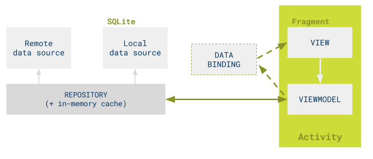
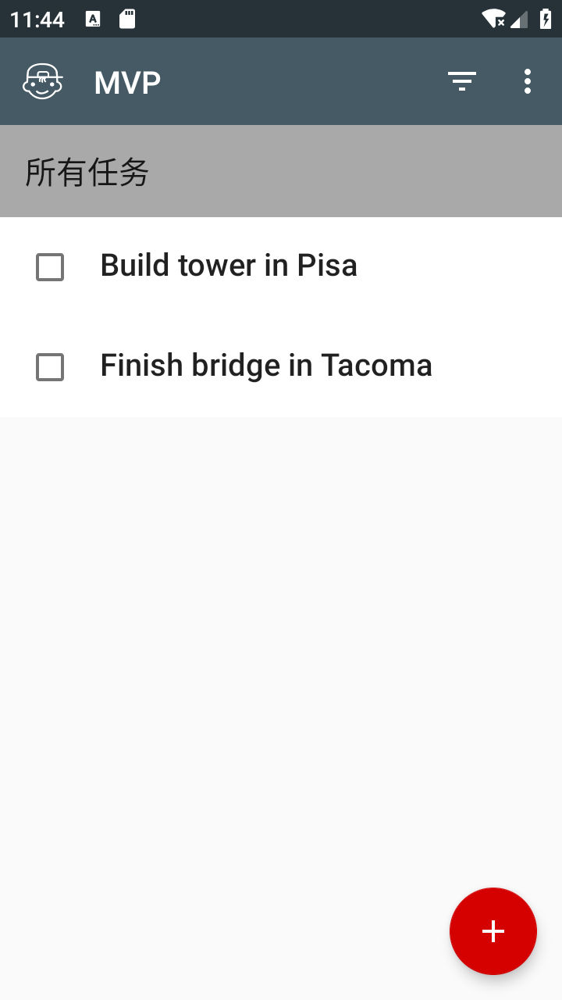
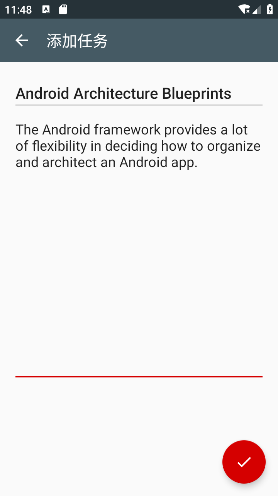
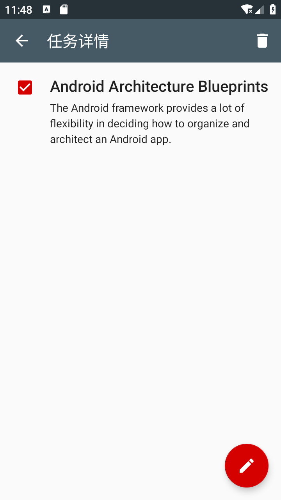
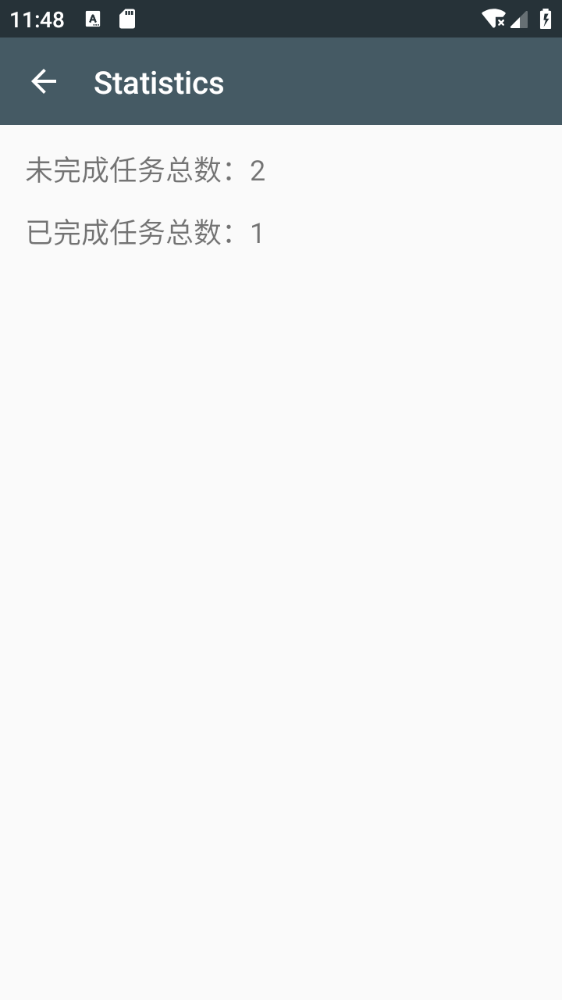

# Android Architecture Blueprints

> * **作者**：March
> * **链接**：[安卓项目或模块](https://github.com/maoqiqi/DevelopmentArms)
> * **邮箱**：fengqi.mao.march@gmail.com
> * **头条**：https://toutiao.io/u/425956/subjects
> * **简书**：https://www.jianshu.com/u/02f2491c607d
> * **掘金**：https://juejin.im/user/5b484473e51d45199940e2ae
> * **CSDN**：http://blog.csdn.net/u011810138
> * **SegmentFault**：https://segmentfault.com/u/maoqiqi
> * **StackOverFlow**：https://stackoverflow.com/users/8223522
>
> 著作权归作者所有。商业转载请联系作者获得授权，非商业转载请注明出处。

Android Architecture Blueprints 使用不同的架构概念和工具实现相同功能的应用程序。


## 目录

* [Overview](#Overview)
* [Design](#Design)
* [Screenshot](#Screenshot)
* [Link](#Link)
* [License](#License)

## Overview

* mvp

    为这个项目中的其他示例提供了基础。样本的目的是:

    * 提供基本的Model-View-Presenter（MVP）架构，而不使用任何架构框架。
    * 作为比较和对比该项目中其他样本的参考点。

    在这个版本以及基于它的其他版本中，每个屏幕都是使用以下类和接口实现的:

    * 定义视图和演示程序之间的连接的Contract类。
    * 创建Fragment和演示程序的Activity。
    * 实现视图接口的Fragment。
    * 实现相应的Contract类中Presenter接口。

    每个版本的应用程序都使用不同的方法实现相同的功能，以展示和对比各种架构设计。

* mvp-kotlin

    这个应用程序是mvp的kotlin版本。为这个项目中的其他kotlin示例提供了基础。样本的目的是:

    * 提供基本的Model-View-Presenter（MVP）架构，而不使用任何架构框架。
    * 作为比较和对比该项目中其他kotlin样本的参考点。
    * 与mvp java项目相比，利用习惯用语kotlin来提高可读性和限制冗长。

* mvp-rxjava

  这个应用程序基于mvp示例。并使用RxJava 2进行数据模型和演示者层之间的通信。

* mvvm-databinding

    该示例使用数据绑定库来显示数据并将UI元素绑定到操作。为这个项目中的其他databinding示例提供了基础。样本的目的是:

    * 提供基本的Model-View-ViewModel（MVVM）架构，而不使用任何架构框架。
    * 作为比较和对比该项目中其他样本的参考点。

* mvvm-live

    这个应用程序基于mvvm-databinding示例。它使用一些架构组件，如ViewModel，LiveData和其他生命周期感知类。

    尽管父样本已经使用了ViewModel，因为它遵循MVVM体系结构，但体系结构组件在设计上有不同的限制。

    为了简单和与父分支相似，存储库不使用LiveData来公开其数据。

* mvvm-live-kotlin

    这个应用程序是mvvm-live的kotlin版本。它使用一些架构组件，如ViewModel，LiveData和其他生命周期感知类。

    尽管父样本已经使用了ViewModel，因为它遵循MVVM体系结构，但体系结构组件在设计上有不同的限制。

    为了简单和与父分支相似，存储库不使用LiveData来公开其数据。


## Design

所有版本的应用程序都包含相同的常用功能。该应用程序包含四个UI屏幕：

* `Tasks`：用于管理任务列表。
* `AddEditTask`：用于添加或修改任务。
* `TaskDetail`：用于查看或删除任务。
* `Statistics`：显示与任务相关的统计信息。

MVP架构


MVVM架构



MVVM体系结构中的ViewModel与MVP体系结构中的Presenter扮演类似的角色。这两种体系结构的不同之处在于View分别与ViewModel或Presenter进行通信：

* 当应用程序修改MVVM体系结构中的ViewModel时，View会自动由库或框架更新。您无法直接从ViewModel更新View，因为ViewModel无权访问必要的引用。
* 但是，您可以在MVP体系结构中从Presenter更新View，因为它具有对View的必要引用。如果需要进行更改，您可以从Presenter显式调用View来更新它。
  在此项目中，您使用布局文件将ViewModel中的可观察字段绑定到特定UI元素（如TextView或ImageView）。数据绑定库确保View和ViewModel保持双向同步。


## Screenshot










## Link

* [Data Binding Library(数据绑定库)](md/data_binding.md)
* [Handling Lifecycle(处理声明周期)](md/lifecycle.md)
* [LiveData](md/live_data.md)
* [Paging Library(分页库)](md/paging.md)
* [Room Persistence Library(数据库持久化库)](md/room.md)
* [ViewModel(视图模型)](md/view_model.md)


## License

```
   Licensed under the Apache License, Version 2.0 (the "License");
   you may not use this file except in compliance with the License.
   You may obtain a copy of the License at

       http://www.apache.org/licenses/LICENSE-2.0

   Unless required by applicable law or agreed to in writing, software
   distributed under the License is distributed on an "AS IS" BASIS,
   WITHOUT WARRANTIES OR CONDITIONS OF ANY KIND, either express or implied.
   See the License for the specific language governing permissions and
   limitations under the License.
```