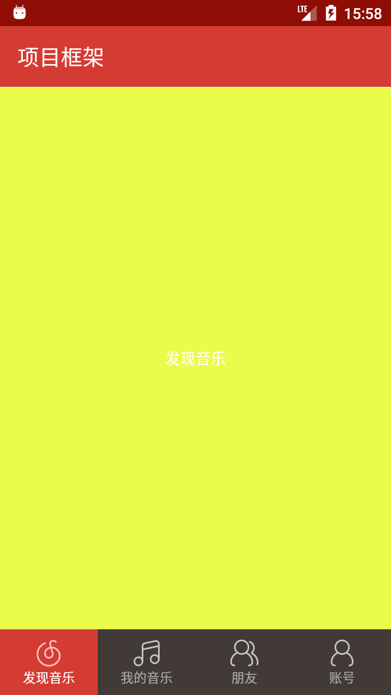
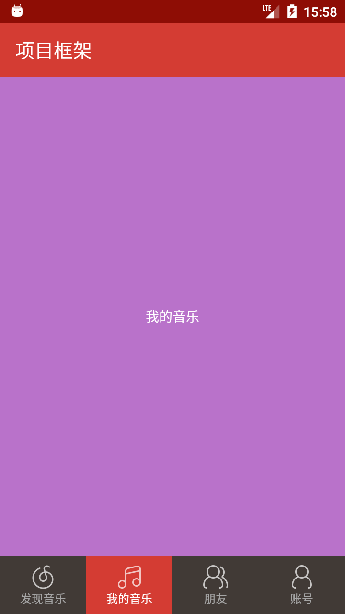
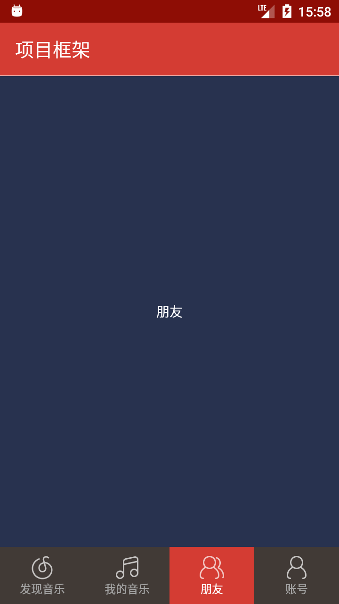
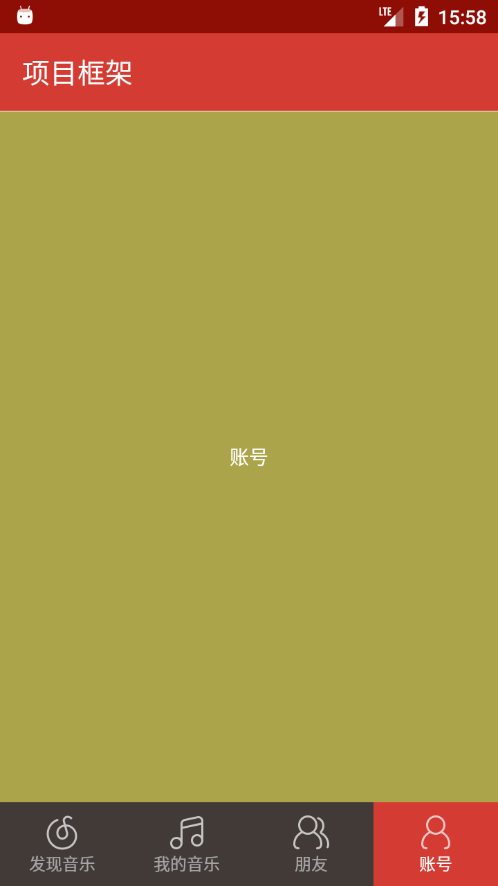

# RadioGroup + Fragment 模板

> * **作者**：March
> * **链接**：[安卓项目或模块](https://github.com/maoqiqi/DevelopmentArms)
> * **邮箱**：fengqi.mao.march@gmail.com
> * **头条**：https://toutiao.io/u/425956/subjects
> * **简书**：https://www.jianshu.com/u/02f2491c607d
> * **掘金**：https://juejin.im/user/5b484473e51d45199940e2ae
> * **CSDN**：http://blog.csdn.net/u011810138
> * **SegmentFault**：https://segmentfault.com/u/maoqiqi
> * **StackOverFlow**：https://stackoverflow.com/users/8223522
>
> 著作权归作者所有。商业转载请联系作者获得授权，非商业转载请注明出处。


使用RadioGroup + Fragment实现TAB选项卡，当应用意外关闭时，再次打开可以恢复关闭时状态。


## 目录

* [Activity重创建处理](#Activity重创建处理)
* [保存Fragment实例](#保存Fragment实例)
* [Screenshot](#Screenshot)
* [Link](#Link)


## Activity重创建处理

当系统配置更改(例如屏幕方向、键盘可用性及语言等)或者内存不足导致Activity重创建时，
会调用onSaveInstanceState()以保存Activity状态信息，我们需要保存当前选中的页面。

要保存当前选中的页面信息，必须实现onSaveInstanceState()并将键值对添加至Bundle对象。如下：

```
@Override
protected void onSaveInstanceState(Bundle outState) {
    super.onSaveInstanceState(outState);
    // 保存当前选中项
    outState.putInt("checkedId", checkedId);
}
```

当Activity重新创建时，可以从系统向Activity传递的Bundle恢复已保存的当前选中的页面信息。如下：

```
@Override
protected void onCreate(@Nullable Bundle savedInstanceState) {
    super.onCreate(savedInstanceState);
    ...
    if (savedInstanceState != null) {
        checkedId = savedInstanceState.getInt("checkedId", R.id.rb_1);
    }
    ...
}
```

## 保存Fragment实例

在创建Fragment后调用setRetainInstance(boolean)。例如：

```
@Override
public void onCreate(@Nullable Bundle savedInstanceState) {
    super.onCreate(savedInstanceState);
    setRetainInstance(true);
}
```

然后，在需要时使用FragmentManager将Fragment添加到Activity。例如：

```
private void switchFragment(Fragment from, Fragment to) {
    if (to != null && from != to) {// from != to 才切换
        previousFragment = to;
        FragmentTransaction ft = getSupportFragmentManager().beginTransaction();

        // from隐藏
        if (from != null) ft.hide(from);

        if (!to.isAdded()) {
            // 没有被添加,添加to
            ft.add(R.id.fl_content, to, currentTag).commit();
        } else {
            // 已经被添加,显示to
            ft.show(to).commit();
        }
    }
}
```

在应用意外关闭后再次启动Activity时，可以从FragmentManager获得Fragment缓存实例对象。例如：

```
@Override
protected void onCreate(@Nullable Bundle savedInstanceState) {
    super.onCreate(savedInstanceState);
    setContentView(R.layout.activity_main);
    ...
    if (savedInstanceState != null) {
        ...
        fragment1 = (Fragment1) getSupportFragmentManager().findFragmentByTag(TAG_1);
        fragment2 = (Fragment2) getSupportFragmentManager().findFragmentByTag(TAG_2);
        fragment3 = (Fragment3) getSupportFragmentManager().findFragmentByTag(TAG_3);
        fragment4 = (Fragment4) getSupportFragmentManager().findFragmentByTag(TAG_4);
    }
    ...
}
```


## Screenshot







## Link

* [Activity + Fragment 基础知识](../Activity+Fragment)
* [RadioGroup + ViewPager + Fragment 模板](../RadioGroup+ViewPager+Fragment)
* [TabLayout + ViewPager + Fragment 模板](../TabLayout+ViewPager+Fragment)