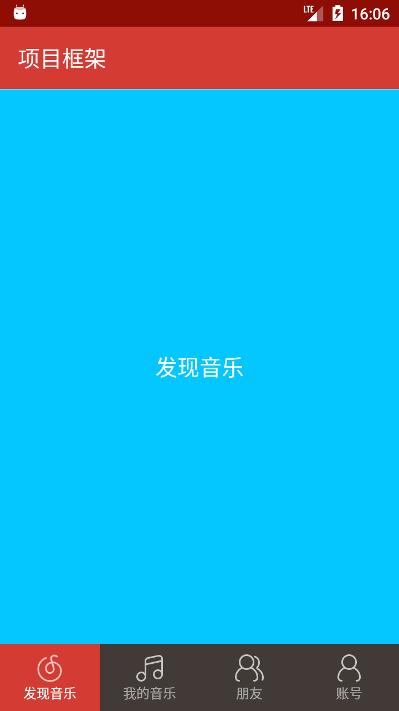
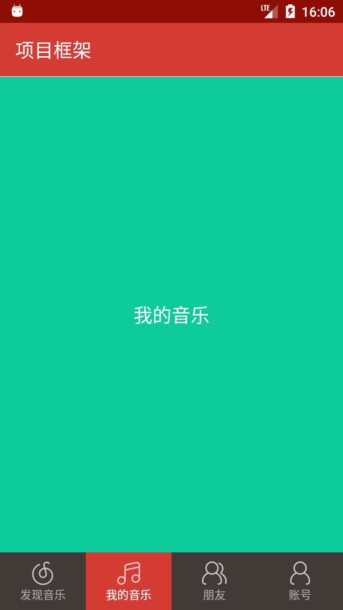
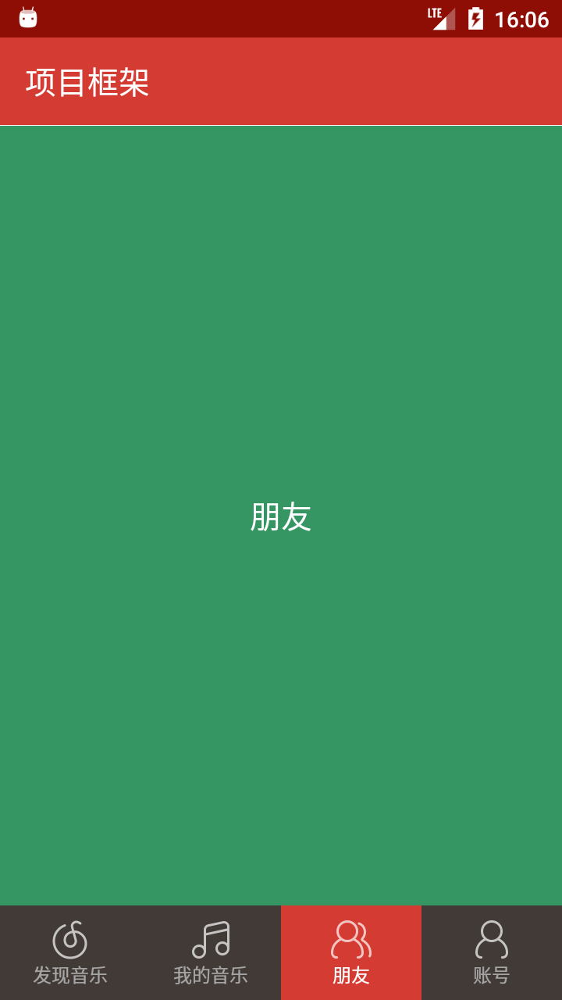
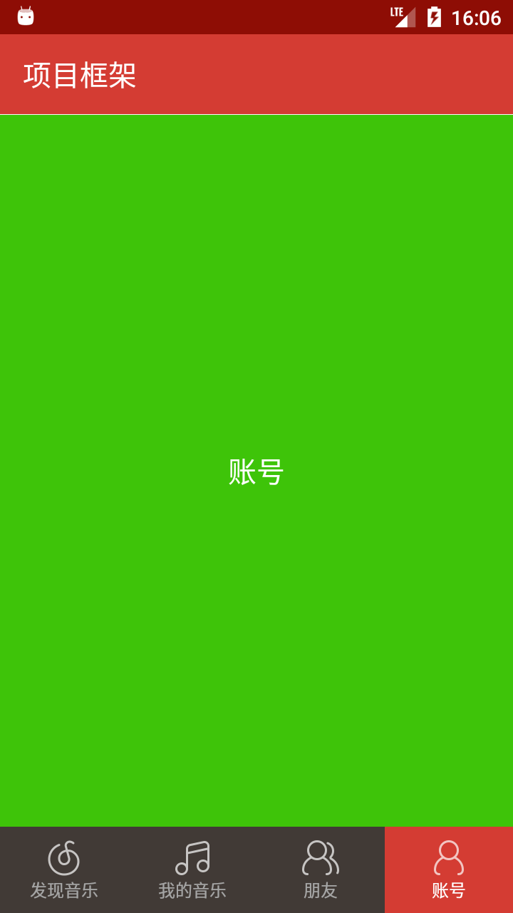

# RadioGroup + ViewPager + Fragment 模板

> * **作者**：March
> * **链接**：[安卓项目或模块](https://github.com/maoqiqi/DevelopmentArms)
> * **邮箱**：fengqi.mao.march@gmail.com
> * **头条**：https://toutiao.io/u/425956/subjects
> * **简书**：https://www.jianshu.com/u/02f2491c607d
> * **掘金**：https://juejin.im/user/5b484473e51d45199940e2ae
> * **CSDN**：http://blog.csdn.net/u011810138
> * **SegmentFault**：https://segmentfault.com/u/maoqiqi
> * **StackOverFlow**：https://stackoverflow.com/users/8223522
>
> 著作权归作者所有。商业转载请联系作者获得授权，非商业转载请注明出处。


使用RadioGroup + ViewPager + Fragment实现滑动选项卡。当应用意外关闭时，再次打开可以恢复关闭时状态。


## 目录

* [Activity重创建处理](#Activity重创建处理)
* [保存Fragment实例](#保存Fragment实例)
* [FragmentPagerAdapter和FragmentStatePagerAdapter](#FragmentPagerAdapter和FragmentStatePagerAdapter)
  * [FragmentPagerAdapter和FragmentStatePagerAdapter的区别](#FragmentPagerAdapter和FragmentStatePagerAdapter的区别)
  * [是否有必要自己缓存Fragment实例对象List集合](#是否有必要自己缓存Fragment实例对象List集合)
* [Screenshot](#Screenshot)
* [Link](#Link)


## Activity重创建处理

当系统配置更改(例如屏幕方向、键盘可用性及语言等)或者内存不足导致Activity重创建时， 会调用onSaveInstanceState()以保存Activity状态信息，我们需要保存当前选中索引。

要保存当前选中索引，必须实现onSaveInstanceState()并将键值对添加至Bundle对象。如下：

```
@Override
protected void onSaveInstanceState(Bundle outState) {
    super.onSaveInstanceState(outState);
    // 保存当前选中索引
    outState.putInt("position", position);
}
```

当Activity重新创建时，可以从系统向Activity传递的Bundle恢复已保存的当前选中索引。如下：

```
@Override
protected void onCreate(@Nullable Bundle savedInstanceState) {
    super.onCreate(savedInstanceState);
    ...
    if (savedInstanceState != null) {
        position = savedInstanceState.getInt("position", 0);
    }
    ...
}
```


## 保存Fragment实例

在创建Fragment后调用setRetainInstance(boolean)。例如：

```
@Override
public void onCreate(@Nullable Bundle savedInstanceState) {
    super.onCreate(savedInstanceState);
    setRetainInstance(true);
}
```

然后，在需要时使用FragmentManager将Fragment添加到Activity。当你使用FragmentPagerAdapter时，FragmentPagerAdapter帮我们实现了。
在应用意外关闭后再次启动Activity时，可以从FragmentManager获得缓存的Fragment实例对象。代码如下：

```
@NonNull
public Object instantiateItem(@NonNull ViewGroup container, int position) {
    if (this.mCurTransaction == null) {
        this.mCurTransaction = this.mFragmentManager.beginTransaction();
    }

    long itemId = this.getItemId(position);
    String name = makeFragmentName(container.getId(), itemId);
    Fragment fragment = this.mFragmentManager.findFragmentByTag(name);
    if (fragment != null) {
        this.mCurTransaction.attach(fragment);
    } else {
        fragment = this.getItem(position);
        this.mCurTransaction.add(container.getId(), fragment, makeFragmentName(container.getId(), itemId));
    }

    if (fragment != this.mCurrentPrimaryItem) {
        fragment.setMenuVisibility(false);
        fragment.setUserVisibleHint(false);
    }

    return fragment;
}
```


## FragmentPagerAdapter和FragmentStatePagerAdapter

### FragmentPagerAdapter和FragmentStatePagerAdapter的区别

1. FragmentPagerAdapter将每一个生成的Fragment保存在内存中，limit外Fragment没有销毁。

   FragmentStatePagerAdapter将limit内生成的Fragment保存在内存中，对limit外的Fragment销毁。

2. FragmentPagerAdapter的生命周期为：onPause->onStop->onDestroyView，onCreateView->onStart->onResume。
   Fragment的成员变量都没有变，所以可以缓存根View，避免重复inflate。

   FragmentStatePagerAdapter生命周期为：onPause->onStop->onDestroyView->onDestroy->onDetach，onAttach->onCreate->onCreateView->onStart->onResume。

3. FragmentPagerAdapter使用场景：对于需要缓存在内存中的固定较少数量的静态页面使用FragmentPagerAdapter，设置setOffscreenPageLimit(count-1)。如引导页，Tab页面。

   FragmentStatePagerAdapter使用场景：对于拥有大量页面的情况应使用FragmentStatePagerAdapter，设置setOffscreenPageLimit(1)，避免占用大量内存。如图片预览。

### 是否有必要自己缓存Fragment实例对象List集合

* 对于FragmentPagerAdapter，instantiateItem()先从FragmentManager.findFragmentByTag()中查找FragmentManager中List缓存的Fragment，取不到则会调用getItem()。
  所以对于缓存在内存中的FragmentPagerAdapter没有必要再使用一个List缓存Fragment，因为FragmentPagerAdapter会缓存每一个加载过的Fragment到内存中。

* 对于FragmentStatePagerAdapter，instantiateItem()则会缓存limit左右的Fragment，超过limit则会销毁回收，当Fragment没有缓存时调用getItem()。
  因为页面比较多，所以也没必要使用List缓存Fragment占用内存，否则FragmentStatePagerAdapter没有意义。

  > 注意：在limit内FragmentPagerAdapter和FragmentStatePagerAdapter缓存Fragment没有区别。
  
如果自己缓存Fragment实例对象List集合，再Activity重创建时，会多创建一份毫无作用的Fragment实例对象List集合。如下：

```
@Override
protected void onCreate(@Nullable Bundle savedInstanceState) {
    super.onCreate(savedInstanceState);
    ...
    fragments = new ArrayList<>();
    fragments.add(Fragment1.newInstance());
    fragments.add(Fragment2.newInstance());
    fragments.add(Fragment3.newInstance());
    fragments.add(Fragment4.newInstance());
    ...
}
```

```
// 第一次打开运行日志
02-27 16:25:05.475 Fragment1: -->创建Fragment1
02-27 16:25:05.475 Fragment2: -->创建Fragment2
02-27 16:25:05.475 Fragment3: -->创建Fragment3
02-27 16:25:05.475 Fragment4: -->创建Fragment4

02-27 16:25:05.475 MainActivity: ------------------------------------
02-27 16:25:05.475 Fragment1: Fragment->hashCode():195657565
02-27 16:25:05.475 Fragment2: Fragment->hashCode():182960338
02-27 16:25:05.475 Fragment3: Fragment->hashCode():98125219
02-27 16:25:05.475 Fragment4: Fragment->hashCode():265060512
02-27 16:25:05.475 MainActivity: ------------------------------------

02-27 16:25:05.524 Fragment1: instantiateItem()->Fragment->hashCode():195657565
02-27 16:25:05.524 Fragment2: instantiateItem()->Fragment->hashCode():182960338
```

```
// Activity重新创建时运行日志
02-27 16:25:33.146 Fragment1: -->创建Fragment1
02-27 16:25:33.146 Fragment2: -->创建Fragment2
02-27 16:25:33.150 Fragment3: -->创建Fragment3
02-27 16:25:33.151 Fragment4: -->创建Fragment4

02-27 16:25:33.151 MainActivity: ------------------------------------
02-27 16:25:33.152 Fragment1: Fragment->hashCode():109342100
02-27 16:25:33.152 Fragment2: Fragment->hashCode():71168061
02-27 16:25:33.152 Fragment3: Fragment->hashCode():163582002
02-27 16:25:33.152 Fragment4: Fragment->hashCode():73552259
02-27 16:25:33.152 MainActivity: ------------------------------------

02-27 16:25:33.198 Fragment4: instantiateItem()->Fragment->hashCode():265060512
02-27 16:25:33.199 Fragment3: instantiateItem()->Fragment->hashCode():98125219
```

当Activity重创建时候，FragmentManager会帮助我们保存与恢复已经添加到其中的实例。
因此虽然我们往List中又add了新new的Fragment实例，但是这Fragment发现该位置的实例有保存就不会去调用getItem。
只有在Activity重建前没有添加到FragmentManger中的实例才会去调用getItem。

因此我们在getItem方法调用时候再去创建Fragment实例，就可以避免上面多创建无用实例的问题，这一点对于FragmentStatePagerAdapter来说同样适用。所以我们应该这样：

```
// 得到对应的Fragment
private Fragment getFragment(int position) {
    switch (position) {
        case 0:
            return Fragment1.newInstance();
        case 1:
            return Fragment2.newInstance();
        case 2:
            return Fragment3.newInstance();
        case 3:
            return Fragment4.newInstance();
    }
    return null;
}
```

```
@Override
public Fragment getItem(int position) {
    Log.d("Fragment" + (position + 1), "getItem(int position), position = " + position);
    return getFragment(position);
}
```

修改代码之后运行打印日志如下：

```
03-01 15:04:33.908 Fragment1: getItem(int position), position = 0
03-01 15:04:33.908 Fragment1: -->创建Fragment1
03-01 15:04:33.908 Fragment1: instantiateItem()->Fragment->hashCode():151223339

03-01 15:04:33.908 Fragment2: getItem(int position), position = 1
03-01 15:04:33.909 Fragment2: -->创建Fragment2
03-01 15:04:33.909 Fragment2: instantiateItem()->Fragment->hashCode():177416328

03-01 15:04:44.247 Fragment3: getItem(int position), position = 2
03-01 15:04:44.248 Fragment3: -->创建Fragment3
03-01 15:04:44.252 Fragment3: instantiateItem()->Fragment->hashCode():242631988

03-01 15:04:50.548 Fragment4: getItem(int position), position = 3
03-01 15:04:50.548 Fragment4: -->创建Fragment4
03-01 15:04:50.549 Fragment4: instantiateItem()->Fragment->hashCode():98125219
```

```
// Activity重新创建时运行日志
03-01 15:04:59.186 Fragment4: instantiateItem()->Fragment->hashCode():98125219
03-01 15:04:59.186 Fragment3: instantiateItem()->Fragment->hashCode():242631988
```

****：


## Screenshot







## Link

* [Activity + Fragment 基础知识](../Activity+Fragment)
* [RadioGroup + Fragment 模板](../RadioGroup+Fragment)
* [TabLayout + ViewPager + Fragment 模板](../TabLayout+ViewPager+Fragment)
* [自定义懒加载Fragment](https://github.com/maoqiqi/LazyLoad)