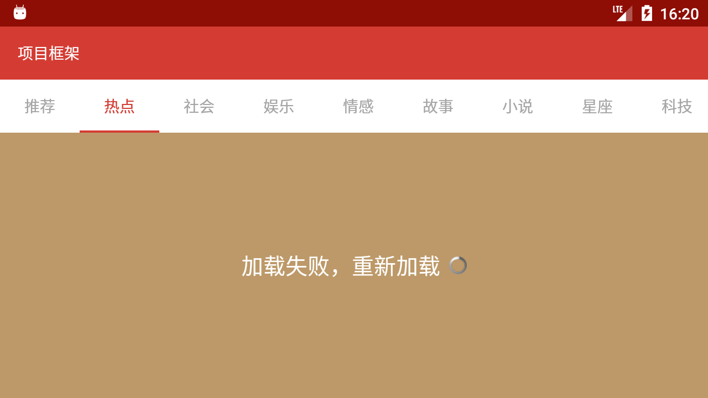
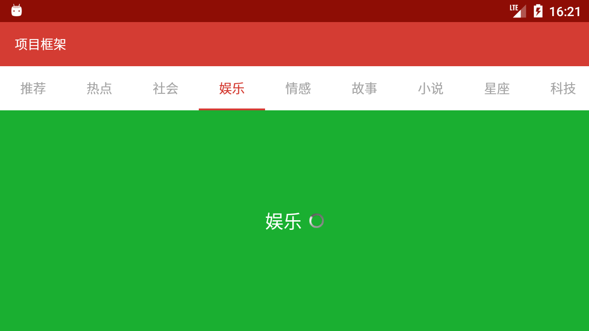
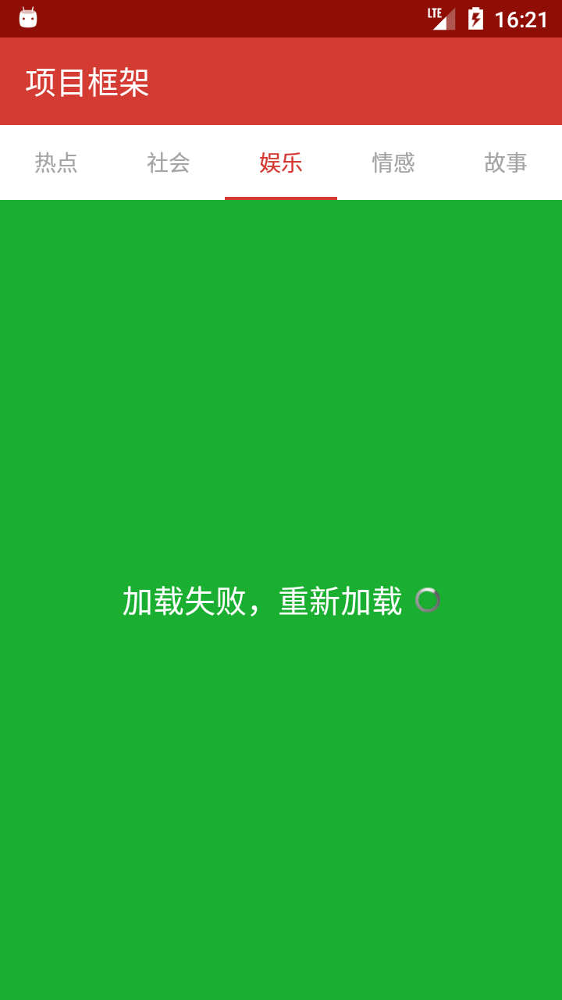

# TabLayout + ViewPager + Fragment 模板

> * **作者**：March
> * **链接**：[安卓项目或模块](https://github.com/maoqiqi/DevelopmentArms)
> * **邮箱**：fengqi.mao.march@gmail.com
> * **头条**：https://toutiao.io/u/425956/subjects
> * **简书**：https://www.jianshu.com/u/02f2491c607d
> * **掘金**：https://juejin.im/user/5b484473e51d45199940e2ae
> * **CSDN**：http://blog.csdn.net/u011810138
> * **SegmentFault**：https://segmentfault.com/u/maoqiqi
> * **StackOverFlow**：https://stackoverflow.com/users/8223522
>
> 著作权归作者所有。商业转载请联系作者获得授权，非商业转载请注明出处。


使用TabLayout + ViewPager + Fragment实现滑动选项卡。当应用意外关闭时，再次打开可以恢复关闭时状态。


## 目录

* [Activity重创建处理](#Activity重创建处理)
* [保存Fragment实例](#保存Fragment实例)
* [Screenshot](#Screenshot)
* [Link](#Link)


## Activity重创建处理

当系统配置更改(例如屏幕方向、键盘可用性及语言等)或者内存不足导致Activity重创建时， 会调用onSaveInstanceState()以保存Activity状态信息，我们需要保存当前选中索引。

要保存当前选中索引，必须实现onSaveInstanceState()并将键值对添加至Bundle对象。如下：

```
@Override
protected void onSaveInstanceState(Bundle outState) {
    super.onSaveInstanceState(outState);
    outState.putInt("position", position);
}
```

当Activity重新创建时，可以从系统向Activity传递的Bundle恢复已保存的当前选中索引。如下：

```
@Override
protected void onCreate(@Nullable Bundle savedInstanceState) {
    super.onCreate(savedInstanceState);
    ...
    if (savedInstanceState != null) {
        position = savedInstanceState.getInt("position", 0);
    }
    ...
}
```


## 保存Fragment实例

在创建Fragment后调用setRetainInstance(boolean)。例如：

```
@Override
public void onCreate(@Nullable Bundle savedInstanceState) {
    super.onCreate(savedInstanceState);
    setRetainInstance(true);
}
```

然后，在需要时使用FragmentManager将Fragment添加到Activity。当你使用FragmentPagerAdapter时，FragmentPagerAdapter帮我们实现了。
在应用意外关闭后再次启动Activity时，可以从FragmentManager获得缓存的Fragment实例对象。代码如下：

```
@NonNull
public Object instantiateItem(@NonNull ViewGroup container, int position) {
    if (this.mCurTransaction == null) {
        this.mCurTransaction = this.mFragmentManager.beginTransaction();
    }

    long itemId = this.getItemId(position);
    String name = makeFragmentName(container.getId(), itemId);
    Fragment fragment = this.mFragmentManager.findFragmentByTag(name);
    if (fragment != null) {
        this.mCurTransaction.attach(fragment);
    } else {
        fragment = this.getItem(position);
        this.mCurTransaction.add(container.getId(), fragment, makeFragmentName(container.getId(), itemId));
    }

    if (fragment != this.mCurrentPrimaryItem) {
        fragment.setMenuVisibility(false);
        fragment.setUserVisibleHint(false);
    }

    return fragment;
}
```


## Screenshot









## Link

* [Activity + Fragment 基础知识](../Activity+Fragment)
* [RadioGroup + Fragment 模板](../RadioGroup+Fragment)
* [RadioGroup + ViewPager + Fragment 模板](../RadioGroup+ViewPager+Fragment)
* [自定义懒加载Fragment](https://github.com/maoqiqi/LazyLoad)